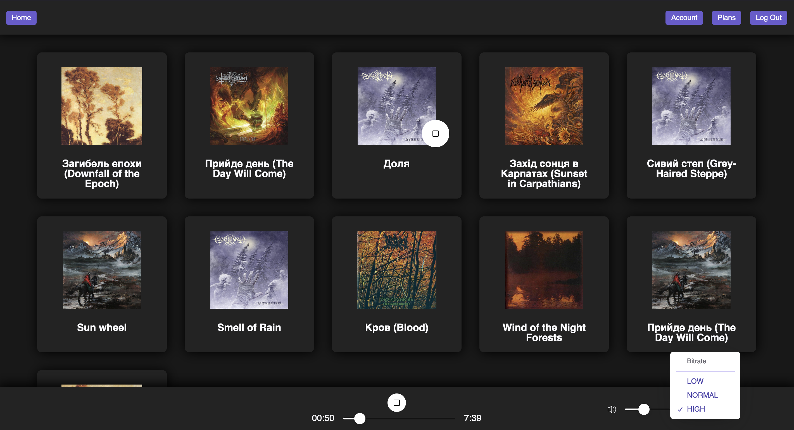
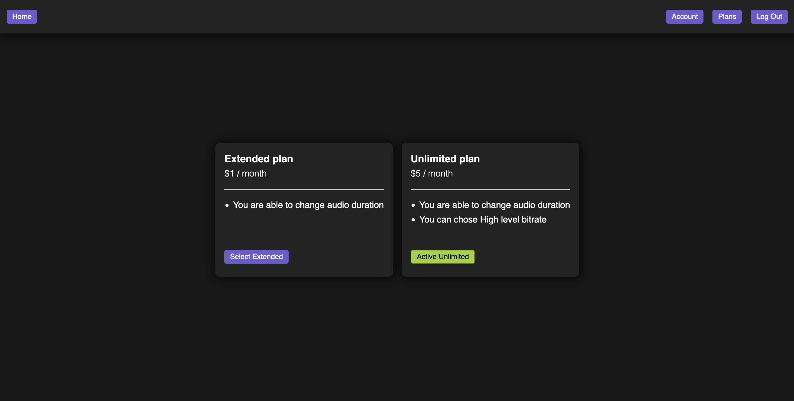
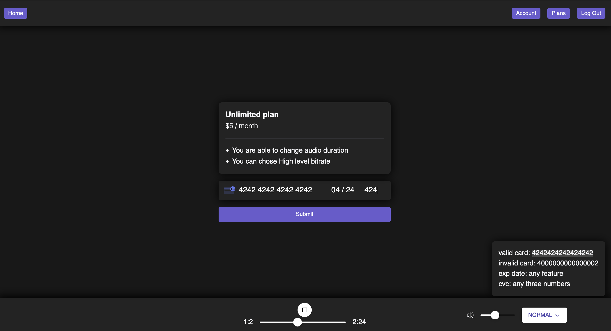
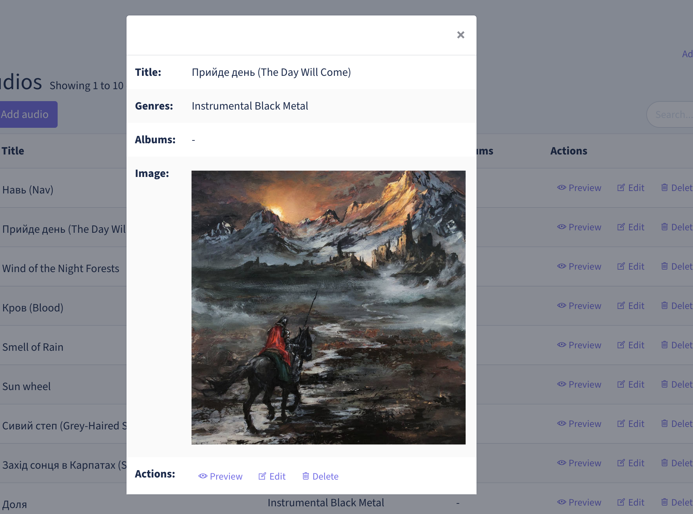
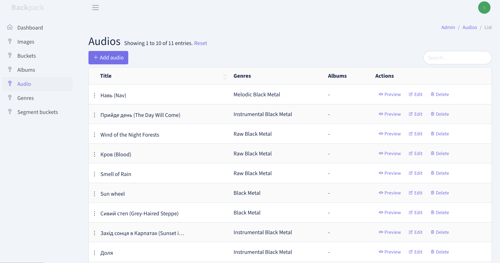

Music service where users upload their music, with the option for
users to subscribe to the service and access premium features (Different bit-rates, change duration).

### Build

Start base services:
```bash
docker-compose up
```

Start client:
```bash
 docker-compose -f client.docker-compose.yml up
```

Start stripe:
```bash
stripe listen --forward-to localhost/stripe/webhook
```

Client available at [http://localhost:3000/](http://localhost:3000/) </br>
Admin panel available at [http://localhost/admin/](http://localhost/admin/) </br>

Also, don't forget to provide the Stripe environment variable:
```env
STRIPE_SECRET=sk_test_...
STRIPE_KEY=pk_test_...
STRIPE_WEBHOOK_SECRET=whsec_...
STRIPE_EXTENDED_PRODUCT=price_...
STRIPE_UNLIMITED_PRODUCT=price_...
```

### Screenshots










